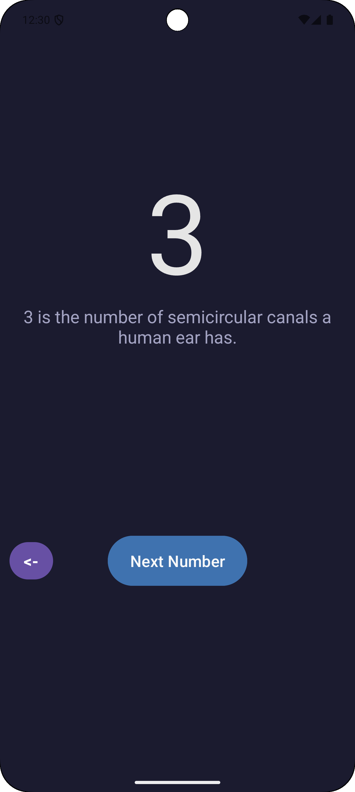
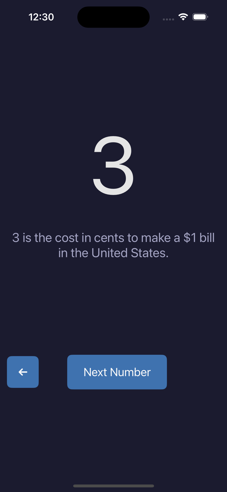
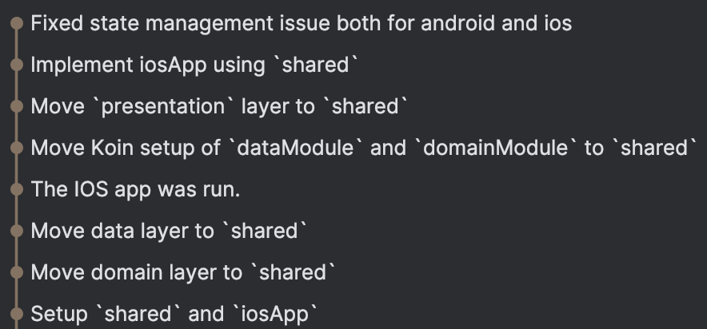

# AndroidToKMP

This is a sample project to demonstrate how to convert an existing Android project to a Kotlin Multiplatform project.

|          | Android | iOS |
|----------|---------|-----|
| Branch   | `main`  | `kmp_ios` |
| DI   | 🟢 Koin  | 🟢 Koin |
| Presentation layer   | 🟢 ViewModel  | 🟢 ViewModel |
| Domain layer   | 🟢 Coroutines  | 🟢 Coroutines |
| Data layer   | 🟢 DataStore 🟡 Gson 🟡 OkHttp 🟡 Retrofit  | 🟢 DataStore 🟡 KotlinxSerialization 🟡 Ktor 🟡 Ktorfit |

🟢 - Migration was KMP friendly, without significant changes.  
🟡 - Migration to another library was needed.

UI is not shared and implemented natively, XML is for Android, and SwiftUI is for iOS.

This project showcases the scenario for migration when an Android app may have a lot of XML UI and full migration to Compose may not be an option.

In such a scenario, migration to KMP can still be beneficial as it allows for the sharing of a significant part of logic at a low cost.

| Android | iOS |
|---------|-----|
| 

  | 

 |

#### To see the step by step migration flow to KMP go throug commits history:

